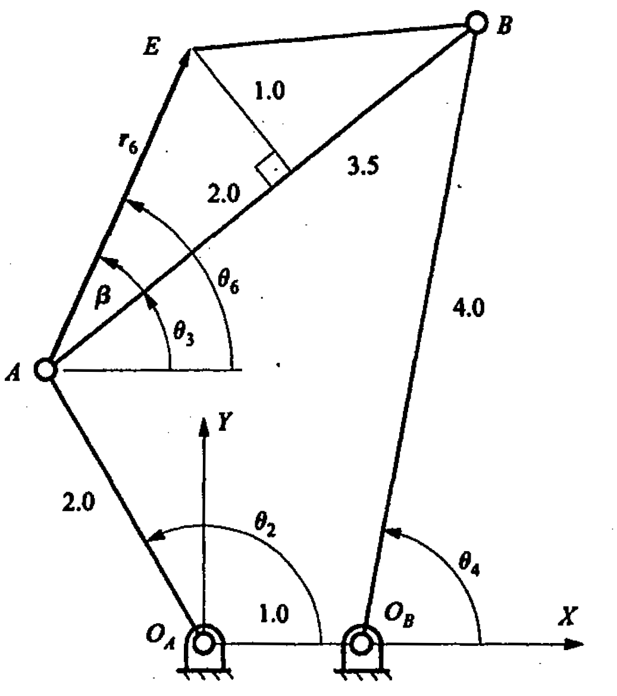

# Analytical Kinematic Analysis of Planar 4-Bar Linkage

This repository contains a Python implementation of the analytical kinematic analysis for a planar 4-bar linkage, given below



Goal: given the driver angle $\theta_2$, calculate the coupler angle $\theta_3$ and the output angle $\theta_4$ and the coordinates of the coupler point E.

## Solution Process

1. **Linkage Definition**: The four-bar mechanism is defined by its link lengths and input crank angle.
2. **Analytical solution**: This follows the elimination method detailed in the lecture notes. This method returns both solutions for the linkage configuration.
3. **Numerical solution**: This is about solving the kinematics equations by equation solver using Newton's iteration method. This method returns one solution for a given initial guess to the solution.
4. **Coupler Point Calculation**: The position of the coupler point is determined for each configuration.
5. **Visualization**: The linkage is plotted for each step, showing the movement and configuration of the mechanism.
6. **Angle Plots**: The coupler and output angles are plotted against the input crank angle to visualize the kinematic behavior.

## How to Run

1. Install Python 3 and the required packages:
   - `numpy`
   - `matplotlib`


2. Run the analytical solution script ([FourBar_Analytical.py](./FourBar_Analytical.py)):
   ```bash
   python FourBar_Analytical.py
   ```

3. Run the numerical Newton solver script ([FourBar_Numerial.py](./FourBar_Numerial.py)):
   ```bash
   python FourBar_Numerial.py
   ```

## References
- [Analytical Position Velocity Acceleration Analysis of planar linkages (Kinzel book).pdf](./Analytical%20Position%20Velocity%20Acceleration%20Analysis%20of%20planar%20linkages%20(Kinzel%20book).pdf)
- [Lecture 2 Analytical Positional Analysis.pdf](./Lecture%202%20Analytical%20Positional%20Analysis.pdf)
- Lecture notes on positional analysis of planar linkages
- Waldron, K.J., Kinzel, G.L., Agrawal, S.K., "Kinematics, Dynamics, and Design of Machinery, Third Edition", John Wiley & Sons, 2016. [Amazon link](https://www.amazon.com/Kinematics-Dynamics-Machinery-Kenneth-Waldron/dp/1118933281)

---

Feel free to modify the link lengths and parameters in the scripts to analyze different 4-bar mechanisms.
